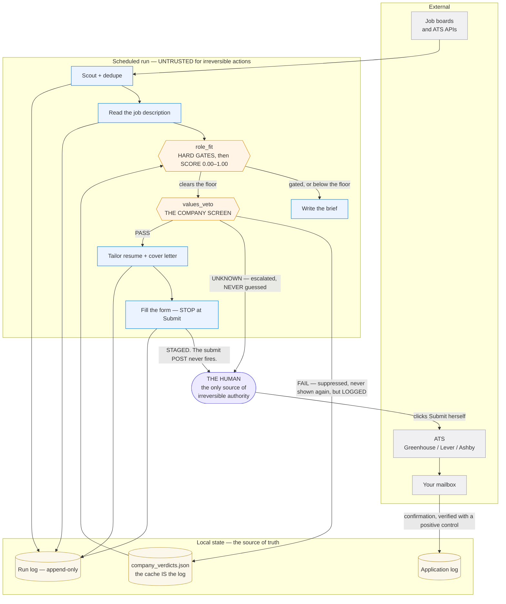
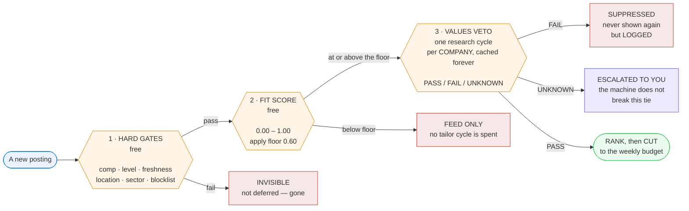
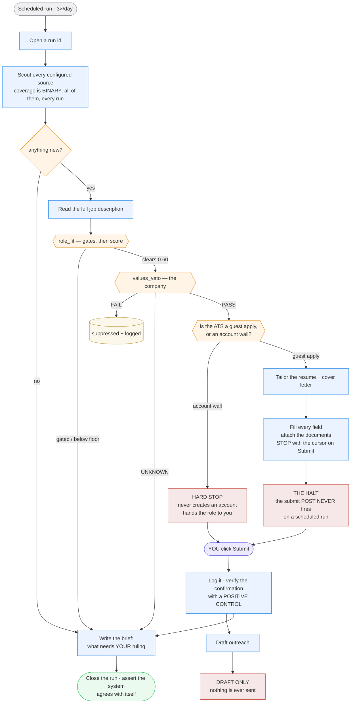
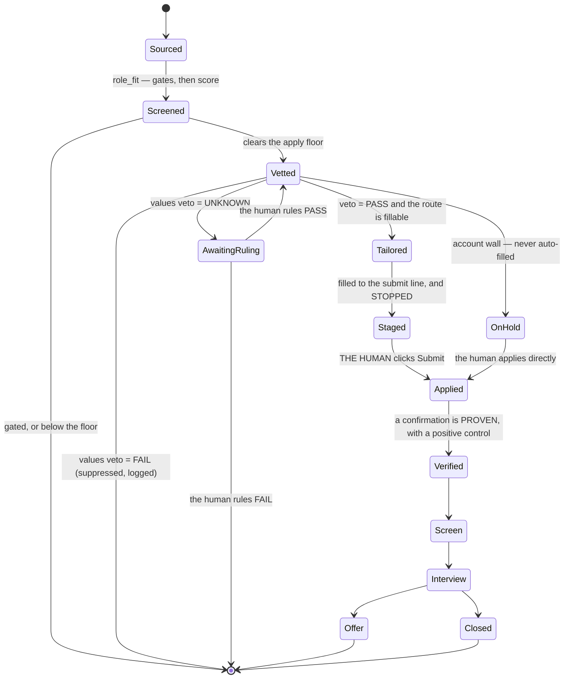

# Architecture

Every diagram on this page renders natively on GitHub. **Nothing here is an image** — you can read the source, and so can a diff.

- [1. The system, and its trust boundaries](#1-the-system-and-its-trust-boundaries)
- [2. The decision pipeline — three gates](#2-the-decision-pipeline--three-gates)
- [3. End-to-end process flow](#3-end-to-end-process-flow)
- [4. The contract — who is allowed to do what](#4-the-contract--who-is-allowed-to-do-what)
- [5. The state model](#5-the-state-model)

---

## 1. The system, and its trust boundaries

The important line on this diagram is the one between **the assistant** and **the human**. The assistant is *untrusted for irreversible actions* — not because it is unreliable, but because "irreversible" and "automated" is a combination that should always require a person.

Everything the assistant does terminates in **a file on your disk**, which is reversible. The only irreversible outcome in the whole system — a submitted application — is reachable **only** through a human click.

---

## 2. The decision pipeline — three gates

Most job-search automation scouts, tailors and applies. The decision of **whether a role deserves the effort** is usually a vibe, a keyword count, or nothing at all.

Three stages, **cheapest first**, each able to kill the role. The expensive one runs **last**.

**Why the apply floor is low (0.60), not high.** A job description is a **wish list** — it describes a person who does not exist. Scoring against a wish list and then demanding 0.80 rejects roles you would win. So the **gates** disqualify, and the **score** only *ranks* what survives.

Clearing the floor is permission to be **ranked**, not permission to apply. Without that last step, a "strict" gate still passes 30 roles a week against a budget of 8 — and you spend your effort on whichever ones happened to be scouted first.

**Why the veto is a gate and not a weight.** You can match 99% of a job description and still not want to work there. When that happens you do not want the role *ranked slightly lower* — you want it **gone**. A score component can only ever discount. Only a gate makes something invisible.

---

## 3. End-to-end process flow

Note the three **red terminals**. They are the only ways the assistant's authority ends, and they are the whole safety design:

1. the submit POST that never fires,
2. the account wall it refuses to touch,
3. outreach that is drafted and never sent.

---

## 4. The contract — who is allowed to do what

**This swimlane *is* the contract.** Read down a lane and you have that actor's complete authority. Read across and you have the run.

The rule that matters: **the assistant's lane never crosses into anything irreversible.** Every arrow that would do so terminates in a red block instead.

```mermaid
flowchart LR
  subgraph SCHED["SCHEDULER"]
    direction TB
    S1["fires 3×/day"]
    S2["cannot mint an approval —<br/>a scheduled run has no authority<br/>to submit anything, ever"]:::deny
  end

  subgraph ASSIST["ASSISTANT — untrusted for anything irreversible"]
    direction TB
    A1["scouts every source"]
    A2["reads the JD"]
    A3["scores it · screens the company"]
    A4["tailors the documents"]
    A5["fills the form to the submit line"]
    A6["logs · reconciles · briefs"]
    AX["MAY NOT: submit · create an account ·<br/>enter a password · solve a captcha ·<br/>send an email · overturn an exclusion ·<br/>break an UNKNOWN tie"]:::deny
  end

  subgraph GUARD["GUARD — mechanical, not procedural"]
    direction TB
    G1["intercepts every ATS write"]
    G2["ABORTS the POST unless an unconsumed,<br/>role-scoped receipt exists"]
    G3["receipts are single-use"]
    GX["a scheduled run cannot mint one,<br/>so unattended submit is IMPOSSIBLE —<br/>not merely forbidden"]:::deny
  end

  subgraph HUMAN["THE HUMAN — the only irreversible authority"]
    direction TB
    H1["clicks Submit"]
    H2["rules on every UNKNOWN"]
    H3["edits the exclusion list"]
    H4["sends the outreach"]
    H5["drags the cards"]
  end

  SCHED --> ASSIST --> GUARD --> HUMAN

  classDef deny fill:#f6e7e8,stroke:#c0392b,color:#1d1d1f
```

| Actor | May | **May not** |
|---|---|---|
| **Scheduler** | Fire the run | **Mint an approval.** A scheduled run has no submit authority — this is structural, not a policy |
| **Assistant** | Scout, read, score, screen, tailor, fill, log, brief | **Submit · create an account · enter a password · solve a captcha · send an email · overturn an exclusion · break an UNKNOWN tie** |
| **Guard** | Abort any ATS write without a valid receipt | Grant itself a receipt |
| **The human** | **Everything irreversible.** Submit · rule on UNKNOWNs · edit the exclusion list · send outreach | — |

**Capability beats policy.** Every "may not" above is enforced by *removing the ability*, not by writing the rule down and hoping:

| The rule | How it is actually enforced |
|---|---|
| Never submit unattended | The network layer **aborts the POST**. A scheduled run cannot mint a receipt. |
| Never overturn an exclusion | `evaluate()` and `record()` **raise** on an excluded company. |
| Never guess a company verdict | Too few researched signals **forces** `UNKNOWN`. |
| Never invent a finding about a person | An adverse person-signal with no citable URL **raises**. |
| Never claim a submission you cannot prove | `record --not-found` is **refused** without a passing positive control. |

A rule you can forget is not a rule.

---

## 5. The state model

An application has one status at a time, and only some transitions are legal. `Applied` is special: you cannot reach it by asserting it — you reach it by **proving** a confirmation arrived.

**`Applied → Verified` is not a formality.** Under a trust-your-word model, a role that failed to submit sits in `Applied` forever, looking healthy, and you never follow up. So the verifier **refuses** to record a "not found" unless a *positive control* — a known-good search that must return a known result — passed first. **A negative result is not evidence until the tool has proven it can find a positive one.**
