<!--
  PUBLIC EDITION. Scrubbed from the as-built internal spec:
  operator name, mailbox host, and employer names removed. The engineering content -
  the guarantees, the failure modes, the residual risks - is unchanged, because
  softening those would defeat the point of publishing it.
-->

# Reverse-Recruiter Job Search System
## Technical Design and Specification

| Field | Value |
|---|---|
| Version | **1.3.0** (see revision history below) |
| Date | July 11, 2026 |
| Status | Implemented; sign-off amended same day per §11 — network-layer guard verified in isolation, not yet wired to the live P4 fill session |
| Owner | the operator |
| Engineer of record | Claude (the employer) |
| Verification | **293 automated audit checks, 293 tests across 11 suites, all passing** |
| Reproduce | `python3 _audit.py` |
| Supersedes | The v1.0 standing-authorization submit model; the v1.2 prose fit gate |

### Revision history (track changes — corrections are logged here, not as new files)

| Date | Version | Change | Source |
|---|---|---|---|
| 2026-07-11 | 1.2.0 | Original: network-layer submit guard signed off; Claude-in-Chrome documented as read-only. | Initial spec |
| 2026-07-11 (same day) | 1.2.1 | CORRECTED: Claude-in-Chrome is not read-only and fills guest-apply forms to the submit line on every trigger, including scheduled — that is the reason the scheduled task exists. `browser_guard.py`'s `GuardedBrowser` is real, tested, and needed, but is a rule/check layer enforcing no-submit-without-approval, not the P4 write path — it has no confirmed instantiation outside its own test/audit files and no `ats_submit` ever logged, so RR-1's "residual risk" is the current state, not a hypothetical. Affected: §2/TDS-1 (diagram + trust-boundary paragraph), §2.1 (component inventory), §5.2 (mechanism), §5.5 (residual risk), §10 RR-1 row, §11 sign-off (amendment appended, not rewritten). | the operator's direct correction, this session |
| 2026-07-11 (same day) | **1.3.0** | **THE ACCEPTANCE CRITERIA. Two new gate stages, P2a and P2b, between the JD read and the tailor cycle.** (1) **P2a `role_fit.py`** — the prose fit rating (Strong/Good/Moderate/Stretch) is **RETIRED**: it was never defined anywhere in the doc set, it never *ranked*, and 31 roles once "passed" it against a budget of 6–8/week. Replaced by hard gates (comp ≥ $240k, Principal/Director/Exec, ≤ 48h, excluded sectors, blocklist) followed by a score on **one numeric system, [0.00, 1.00], asserted in code**, with an apply floor of **0.60** and rank-then-cut to the weekly budget. (2) **P2b `values_veto.py`** — a new **company** screen, and a **gate, not a scoring component**: a 99% JD match at a values-misaligned company must be *invisible*, and a weight can only ever discount. Three states — PASS / FAIL / **UNKNOWN, which is escalated to the operator and never auto-decided.** Two discipline rules are enforced *mechanically*: silence is not a pass (an unresearched signal is `None`, not "good"), and no source, no claim (an adverse finding about a named individual requires a citable URL, or the code raises). (3) The **excluded-company list is a BLOCKLIST, not a verdict** — *"exclusion means exclusion"* — held in `excluded_companies.json` with aliases and subsidiaries; `evaluate()` and `record()` **refuse** on an excluded company, so no research can silently overturn one. Affected: §2 (both diagrams + component inventory), §2.x ER model (`ROLE.fit` is now a float; new `COMPANY_VERDICT` and `EXCLUSION` entities), §3 (workflow flowchart), §3.1 (run loop: P2a, P2b added; P8 corrected to event-driven). New: FR-24 (Must) in the BRD/PRD; FR-16 promoted Should → Must. | the operator's ratified rubric, this session |

> Doc set: **Technical Design + Spec (you are here)** · Process Reference · Run Workflow SOP · System Contract · Data Dictionary · Data Sequence (Mermaid) · BRD/PRD · Project Spec · Audit + Sign-Off.

### Diagram index

Diagrams **new in this document** (created here because no existing artifact carried them). Eleven diagrams plus seven screenshots of the live cockpit:

| # | Diagram | Section |
|---|---|---|
| TDS-1 | System architecture and trust boundaries | §2 |
| TDS-2 | Data model — entity relationships (D1–D14) | §2.2 |
| TDS-3 | Cockpit state machine — the three-way merge | §4.2 |
| TDS-4 | Submit guard — request interception sequence | §5.2 |
| TDS-5 | Submit guard — decision tree | §5.3 |
| TDS-6 | Board reconciler pipeline | §6 |
| TDS-7 | Threat model — what each control actually stops | §5.1 |
| TDS-8 | Test harness coverage map | §8 |
| TDS-9 | Deployment and runtime view | §9 |
| TDS-10 | Cockpit component structure (+ 7 live UI screenshots) | §4 |
| TDS-11 | **End-to-end technical workflow** — systems, actions, dependencies, outputs, happy + unhappy | §3 |

Diagrams that already exist elsewhere and are **referenced, not duplicated**:

| Diagram | Location |
|---|---|
| Tool-annotated data-flow diagram (D1–D14, P1–P8) | `Reverse_Recruiter_Data_Sequence.md` §1 |
| Detailed run sequence (payload/tool level) | `Reverse_Recruiter_Data_Sequence.md` §2 |
| Unhappy paths and guardrail stops | `Reverse_Recruiter_Data_Sequence.md` §3 |
| Single-role journey (surfaced → offer) | `Reverse_Recruiter_Process_Reference.md` §4 |
| Legacy DFD (superseded, retained) | `Reverse_Recruiter_Data_Flow_Diagram.html` |

---

## 1. Purpose and scope

This document specifies **how the system is built and why it is built that way**. The BRD/PRD says what it must do; the SOP says how to operate it; this says how it works and what guarantees it makes.

Scope: the run loop, the cockpit state model, the submit guard, the board reconciler, the activity log, and the test harness that proves all of it.

Out of scope: role sourcing heuristics and resume content strategy, which are judgment, not engineering.

### 1.1 The three design problems this version solves

Every one of these was a real defect, not a hypothetical:

| # | Problem | Root cause | Resolution |
|---|---|---|---|
| 1 | An unattended run could submit an application | The rule lived only in prose. The assistant has shell and filesystem access, so any token or lock file it is told to check, it could also forge or skip. **A control the constrained party can forge is not a control.** | Move enforcement to a layer the assistant cannot forge: the network. §5 |
| 2 | The cockpit showed stale data, or ate the operator's card moves | `load()` preferred `localStorage` over the file, so one drag permanently blinded the browser to every future run | File is authoritative; browser holds only un-logged moves; three-way merge. §4 |
| 3 | The formal log silently drifted behind the board | Nothing carried the operator's drags into the log | One-click export, auto-reconciled idempotently. §6 |

---

## 2. Architecture

### TDS-1 — System architecture and trust boundaries

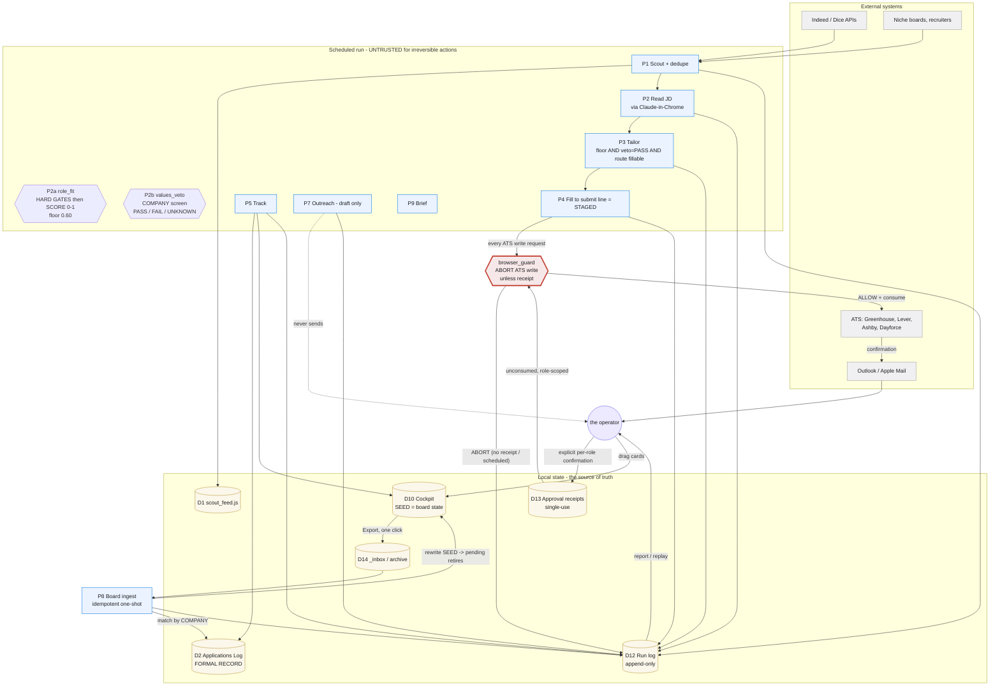

**CORRECTION, 2026-07-11 (this diagram and the paragraph below it describe an intended architecture, not the current one — per the operator directly, and stated plainly rather than smoothed over):** the `P4 -- "every ATS write request" --> GUARD` edge above is not how P4 currently runs. P4 fill (and, per the operator's confirmation this session, fill on every trigger including scheduled) happens via the Claude-in-Chrome MCP tool's own write functions (`form_input`, `file_upload`, `computer`, `tabs_create_mcp`) — a browser surface this diagram does not depict, and one `browser_guard`'s interceptor cannot see. `browser_guard.py`'s `GuardedBrowser` is real and tested but, per code search this session, never instantiated outside its own test/audit files, with no `ats_submit` ever logged. Per the operator: it "is a rule/check layer. thats all...its needed," and connecting it to the real P4 fill session above is "a significant gap we are working to close" — acknowledged, in-progress, not yet done. Read the diagram as the target state for that rule/check layer, not as today's actual data flow.

**Read the trust boundary (as designed; see correction above for current state).** Everything inside `RUN` is treated as untrusted for irreversible actions — not because it is malicious, but because it is fast, tireless, and can be wrong. The intended path from that box to an irreversible outcome (a submitted application) passes through `browser_guard`, gated by a receipt that an unattended run is structurally incapable of minting — but that gate is not yet wired to where P4 fill actually happens (see correction above), so today the thing standing between a filled, staged application and a real submit is the procedural stop in CLAUDE.md 1a-ii (never click, on any trigger, without an explicit yes), not this network-layer mechanism.

### 2.1 Component inventory

| Component | File | Language | Responsibility |
|---|---|---|---|
| Cockpit | `Job_Search_Cockpit.html` | Vanilla JS, single file | The live UI. 7 tabs, all derived from one state. |
| Submit guard | `browser_guard.py` | Python + Playwright | A rule/check layer enforcing no-submit-without-approval (per the operator directly, 2026-07-11) — NOT the browser write path itself. P4 fill and write happen via the Claude-in-Chrome MCP tool, on every trigger. This guard is real and tested but not yet wired around that live session — see the TDS-1 correction above and §5.5/§10. |
| Board reconciler | `board_ingest.py` | Python | Carries operator card moves into the formal record. Idempotent. |
| Activity log | `runlog.py` | Python | Append-only, per-day, per-run audit trail. |
| Tailor | `tailor.py` | Python + python-docx | Per-role resume and cover letter. |
| Formal record | `Skills_to_Roles_Matrix.xlsx` | Excel | Applications Log, columns A–J. |
| Test harness | `test_*.py` | Python + Playwright | §8. |
| Audit | `_audit.py` | Python | 135 checks. The thing that makes sign-off meaningful. |

### 2.2 Data model

Full field-level definitions live in `Reverse_Recruiter_Data_Dictionary.md` (D1–D14). This is the relationship view, which did not previously exist anywhere.

#### TDS-2 — Entity relationships

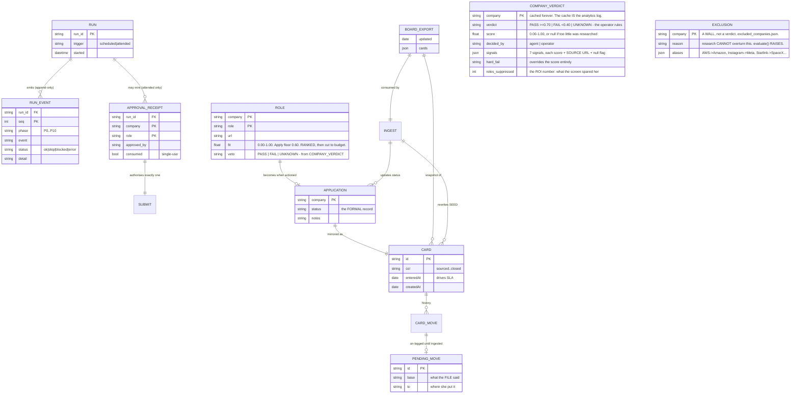

**The one relationship that carries the design:** `PENDING_MOVE.base` records what the *file* said when she made the move. That single field is what makes the three-way merge possible, and it is why a run can never silently overwrite her intent (§4.2).

### 2.3 Design principles (enforced, not aspirational)

1. **The file is the source of truth.** Browser storage is a cache of un-logged intent, never the record.
2. **No hardcoded values.** Every time-dependent or computed value is derived at runtime. Frozen literals rot silently. (`_audit.py` sweeps for them.)
3. **Preventive beats detective; capability beats policy.** If a rule can be enforced by removing an ability, do that instead of writing the rule down.
4. **Log the skips and the blocks, not just the wins.** A run that did nothing must still say why.
5. **Idempotent over stateful.** Prefer a one-shot that is safe to run a thousand times over a daemon that dies silently.
6. **Browser code is not done until it has run in a browser.** Stubs cannot see what browsers do.

---

## 3. End-to-end technical workflow

### TDS-11 — Full E2E: systems, actions, dependencies, outputs (happy and unhappy)

Swimlanes are the actor. Every box names the concrete tool or API. Every terminal names the artifact produced. Red = a guardrail stop.

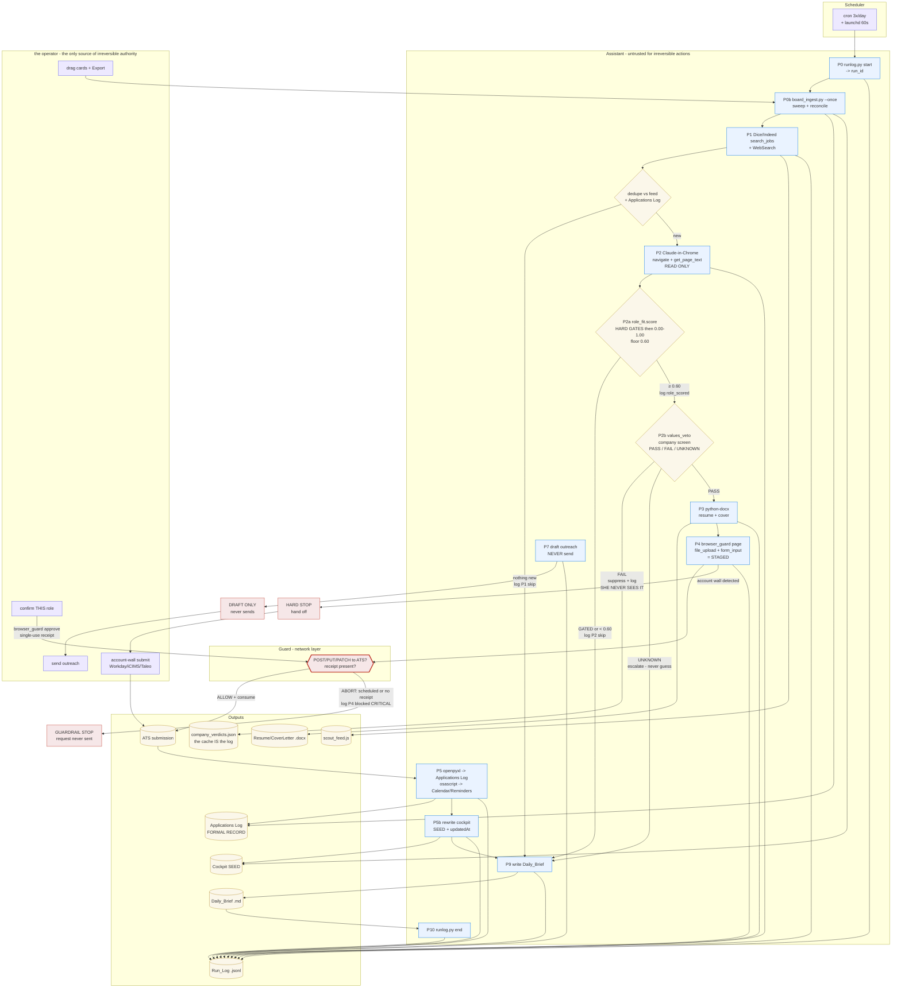

**Read the three red terminals.** They are the only ways the assistant's authority ends: the network abort, the account-wall hand-off, and outreach-is-draft-only. Every other path terminates in a file on your disk, which is reversible. The only irreversible outcome in the whole system — a submitted application — is reachable **only** through a receipt that you mint.

## 3.1 Run loop

| Phase | Step | Output | Failure mode → handling |
|---|---|---|---|
| P0 | Open run id; ingest any board export (0b); read dedupe baseline | `run_id`, reconciled log | — |
| P1 | Scout Indeed/Dice/boards; dedupe on `lower(company)\|lower(role)` | `scout_feed.js` | Nothing new → `skip`, still write the brief |
| P2 | Read full JD (Claude in Chrome, read-only) | Keyword bank | Chrome down → fall back to ATS JSON; note it |
| **P2a** | **`role_fit.score()` — HARD GATES then SCORE.** Gates: comp ≥ $240k, Principal/Director/Exec, ≤ 48h, excluded sectors, blocklist. Then score on **[0.00, 1.00]**, floor **0.60**, then **rank and cut** to the weekly budget | `role_scored` event {score, components}; queue + overflow | Gated → **invisible**, log `P2 skip`. Below floor → feed only, **never tailored**. Missing comp/date → **flag, not reject** |
| **P2b** | **`values_veto` — COMPANY screen. A GATE, not a tiebreaker.** Runs only on floor-clearing roles (it costs a research cycle) and caches per company forever | `company_verdicts.json` | **PASS** → P3. **FAIL** → `note_suppression()`, dropped, never shown again, **but logged**. **UNKNOWN** → escalate to the operator in the brief; **the agent never breaks the tie** |
| P3 | Tailor. **Three conditions, all required:** score clears the floor **AND** veto = PASS **AND** `should_tailor(route)` | `Resume_*.docx`, `CoverLetter_*.docx` | Verify fails → `error`, rebuild, do not stage |
| P4 | Fill to the submit line; submit only through the guard | Staged or submitted | No receipt / scheduled → **POST aborted**, `blocked` |
| P5 | Applications Log; Calendar; Reminders; notify | Formal record | Rows shifted → re-read, match by Company |
| P5b | Cockpit `SEED`/`D` + `updatedAt` | Board state | — |
| P6 | Append new roles to the feed | `scout_feed.js` | — |
| P7 | Draft outreach — **never send** | `Outreach_Map` | No address → `blocked`, flag it |
| P8 | Board ingest. **EVENT-DRIVEN** — launchd `WatchPaths` fires only when `board_data.json` lands (0 idle wakeups/day, down from 1,440 under the old 60s `StartInterval`); the scheduled run is the safety net | Log + SEED reconciled | Bad export → `error`, do not archive. **Archive-is-the-commit**: a crash mid-ingest self-heals on the next trigger |
| P9 | Timestamped brief | `Daily_Brief_*.md` | — |
| P10 | Close the run | Rollup | No `run_end` → reported `[UNCLOSED]` |

---

## 4. Cockpit

The cockpit is the system's only user interface. Everything else is a scheduled process. These are screenshots of the **actual running cockpit**, captured from the live file, not mock-ups.

### 4.0 The seven tabs — all derived from one shared state

#### TDS-10 — Cockpit component structure

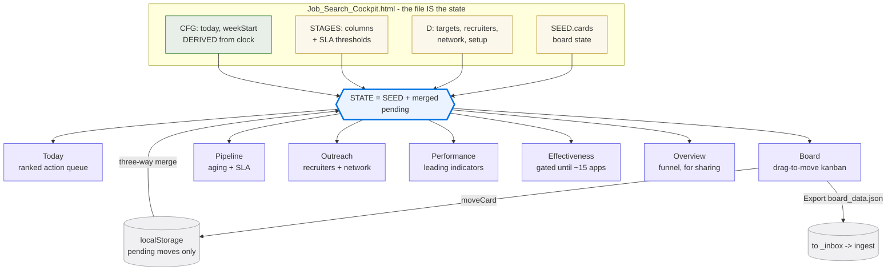

**Today** — the ranked action queue. This is the only tab that matters most mornings: it merges recruiter due dates, SLA breaches on applied roles, on-hold decisions, network drafts, and setup tasks into one list, grouped Overdue → Today → This week → Upcoming → Backlog.

@@IMG:cockpit_today.png@@

**Board** — the drag-to-move kanban. A drop calls `moveCard()`, which appends history, sets the column, resets time-in-column, and writes a pending move. This is the tab the entire state model in §4.2 exists to protect.

@@IMG:cockpit_board.png@@

**Pipeline** — aging and SLA per active role, with the next action spelled out.

@@IMG:cockpit_pipeline.png@@

**Outreach** — recruiter and warm-network cadence against the weekly target. Deliberately *not* on the applications board: outreach is a different funnel.

@@IMG:cockpit_outreach.png@@

**Performance** — leading indicators against target. "Avg days to first response" is computed from card history (§4.3), and reads "No screens yet" honestly rather than showing a fake dash.

@@IMG:cockpit_performance.png@@

**Effectiveness** — deliberately gated. It states plainly that conversion cuts are directional until roughly 15 applications accumulate, rather than drawing confident conclusions from six data points.

@@IMG:cockpit_effectiveness.png@@

**Overview** — executive KPIs and the conversion funnel, built for sharing.

@@IMG:cockpit_overview.png@@

## 4.1 State model

### 4.1.1 The three tiers

| Tier | Where | Written by | Authority |
|---|---|---|---|
| `SEED` / `D` / `STAGES` | In the HTML file, on disk | The scheduled run | **Authoritative** |
| `cockpit_pending_v2` | Browser `localStorage` | Operator drags | Un-logged intent only |
| `STATE` | Memory | `load()` | Derived from the two above |

`CFG` (today, weekStart) is **derived from the system clock**, never stored. It was previously a frozen literal that silently rotted every due date and weekly KPI.

### 4.2 The merge (the heart of the design)

On load: start from `SEED`, then apply each pending move under a **three-way merge** — base (what the file said when the move was made), local (the move), remote (what the file says now).

| Condition | Outcome | Rationale |
|---|---|---|
| Card absent from `SEED` | Drop the move | The role is gone |
| `SEED.col == move.to` | **Retire the move** | The run logged it; the file agrees; the local copy has served its purpose |
| `SEED.col != move.base` | **Drop it — the run wins** | The run has newer authoritative state for this card |
| Otherwise | **Re-apply the move** | The run has not caught up yet; her intent survives reloads and run updates |

#### TDS-3 — Cockpit state machine (per pending move, evaluated on every load)

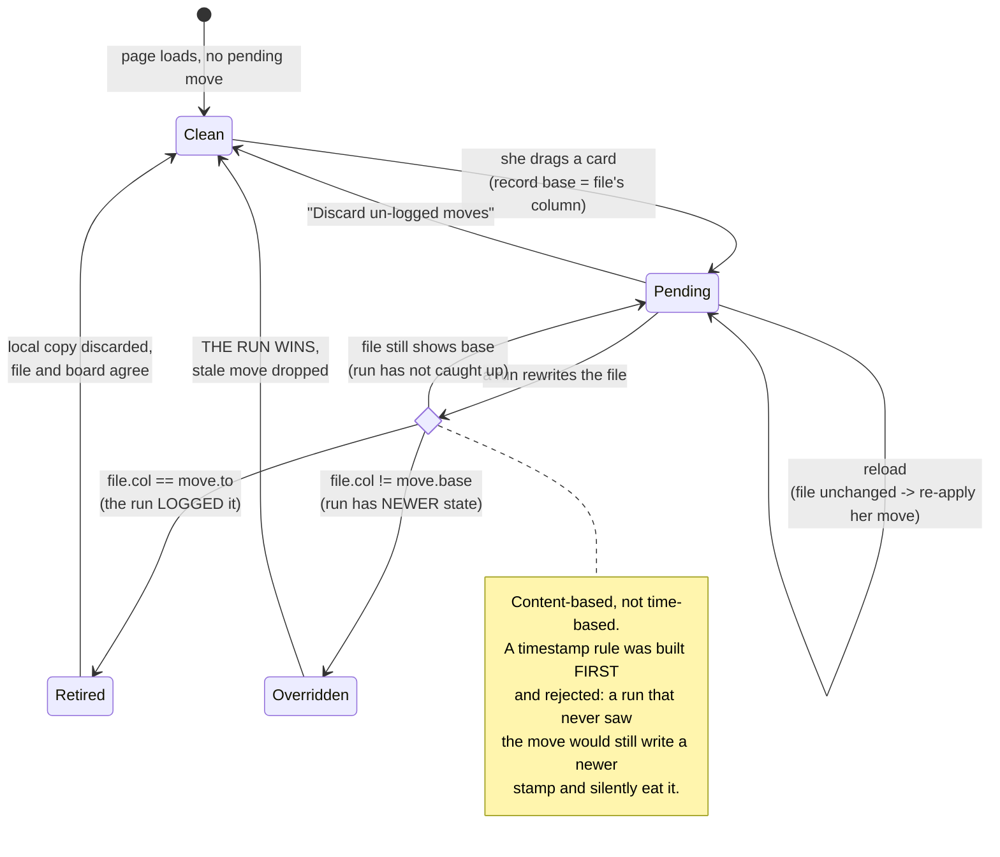

**The rule is content-based, not timestamp-based, and that distinction is the whole design.** I implemented a timestamp rule first (`keep the move if it is newer than SEED.updatedAt`). Tests killed it: a run that *never saw* the move would still write a newer stamp and silently eat it. The file must actually *agree* before the move retires. This is recorded because the wrong answer is the intuitive one.

### 4.3 Cache correctness

The cockpit sends `Cache-Control: no-store`. Discovered by real-browser testing: HTTP `Last-Modified` is one-second granular, so two rewrites of the cockpit inside the same second returned **304 Not Modified** and the browser re-rendered the *stale* board while believing it was current. The merge was correct; the browser never saw the new state. No stub could have found this.

---

## 5. Submit guard — the security-critical component

### 5.1 Threat model

The adversary is **not** a hacker. It is a well-intentioned automated agent (me) that is fast, tireless, has shell access, and can be wrong.

| Attack / failure | Old defence | Verdict |
|---|---|---|
| Unattended run clicks Submit | A sentence in the SOP | **Fails.** Depends entirely on my compliance. |
| A token file the assistant must check | A file | **Fails.** I can write files. Forgeable. |
| A lock file / attended flag | A file | **Fails.** Same. |
| Careless click during a scheduled run | Nothing | **Fails.** |

The only controls that survive an adversary who can write any file and run any command are: **(a) do not give it the capability**, and **(b) make the irreversible action require something it cannot produce.** The guard is (b). §10 recommends (a).

#### TDS-7 — Threat model: what each control actually stops

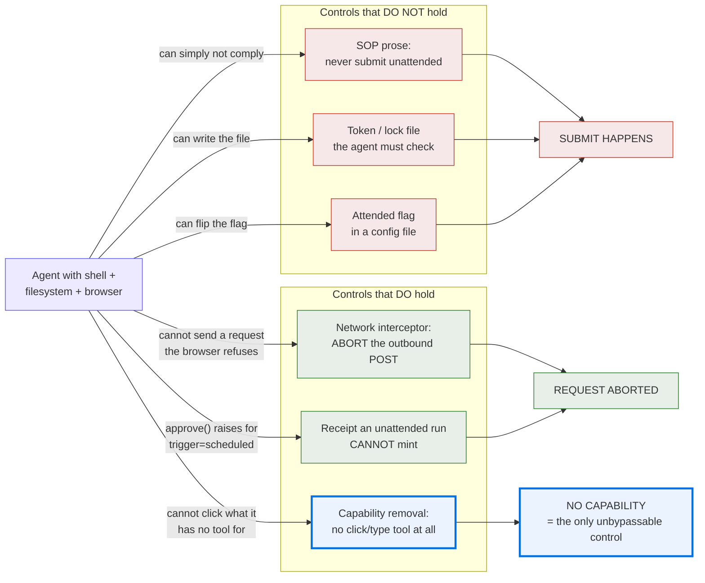

The three red controls all share one flaw: **they ask the constrained party to constrain itself.** The green ones do not. C6 is the only one I cannot undermine at all, which is why §10 asks you — not me — to set it.

### 5.2 Mechanism

#### TDS-4 — Request interception sequence

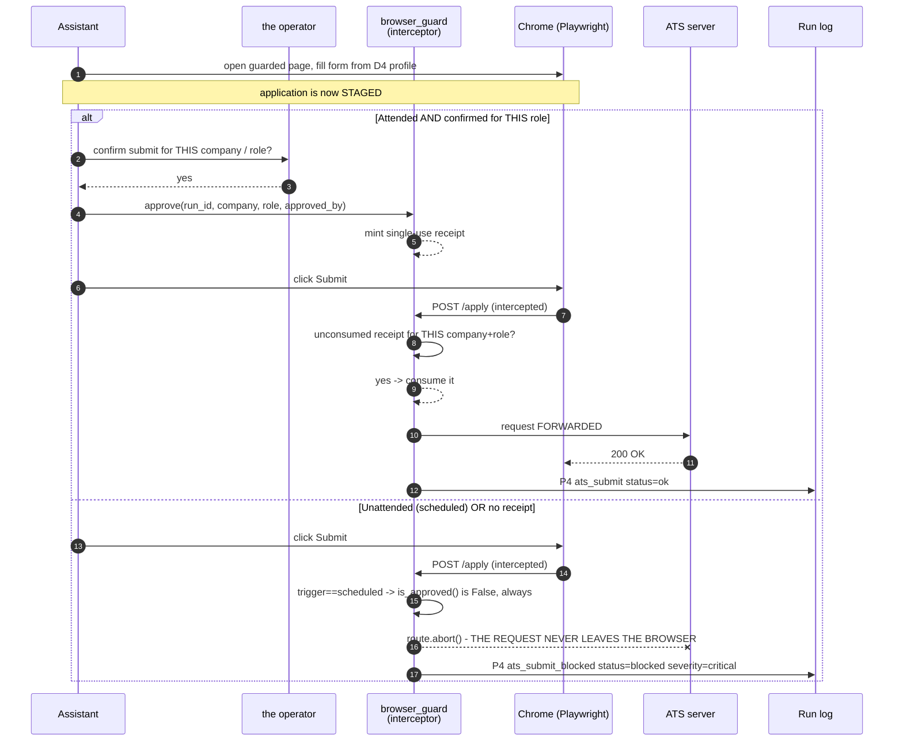

**Why the evidence is trustworthy:** the test asserts against a fake ATS server that records every POST it *genuinely receives*. In the unattended case it receives nothing. The request was not merely labelled blocked — it was never sent.

CORRECTED 2026-07-11: that claim was wrong and the operator reversed it directly. Claude in Chrome is NOT read-only — its write functions fill guest-apply forms to the submit line, on every trigger. The Playwright page with the request interceptor described below is a separate `GuardedBrowser` session, real and tested, but not the one Claude-in-Chrome fills through, and not yet wired to gate that session's submit click. The evidence below (fake ATS server, nothing received) is real evidence that `GuardedBrowser` itself works correctly — it is not evidence about what the live P4 fill session does, since nothing has run through `GuardedBrowser` in production yet.

```
intercept(request):
    if request.method in {POST, PUT, PATCH} and host(request.url) in ATS_HOSTS:
        if unconsumed receipt exists for (run_id, company, role) and trigger != scheduled:
            consume(receipt); log(P4 ats_submit, ok); ALLOW
        else:
            log(P4 ats_submit_blocked, blocked, severity=critical if scheduled)
            ABORT          # the request never leaves the browser
    else:
        ALLOW              # non-ATS traffic untouched
```

#### TDS-5 — Guard decision tree (evaluated on every outbound request)

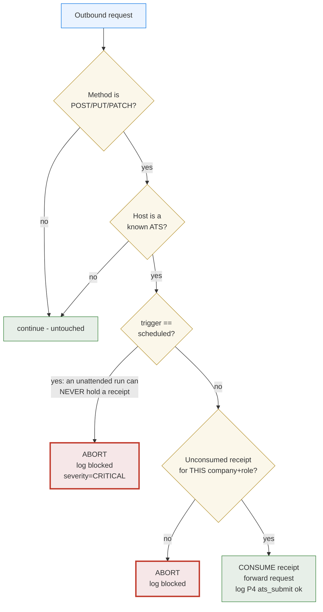

### 5.3 Invariants (each is a test)

| Invariant | Enforced by |
|---|---|
| A scheduled run can never mint a receipt | `approve()` raises `PermissionError` on `trigger="scheduled"` |
| A scheduled run is never approved | `is_approved()` returns False unconditionally for scheduled |
| No receipt → no submit | Interceptor aborts |
| A receipt is single-use | `consumed` flag flipped on allow |
| A receipt unlocks exactly one company+role | Filename is `<company-slug>__<role-slug>.json` |
| Every attempt is auditable | Run log, `severity=critical` for scheduled |

### 5.4 Why the evidence is trustworthy

The tests do not inspect the guard's own opinion of itself. A **fake ATS server records every POST it genuinely receives.** In the unattended case it receives **nothing**. That is ground truth: the request did not merely get marked blocked, it was never sent.

### 5.5 Stated residual risk — UPDATED 2026-07-11: this risk is not hypothetical, it is the current state

This section originally framed the following as a theoretical edge case, "mitigated by hard rule (Chrome is read-only)." That mitigation does not exist: Claude in Chrome is not read-only, and per the operator's direct confirmation, P4 fill runs through it on every trigger. So the scenario below is not a residual risk to weigh — it is what actually happens today. The guard's guarantees, proven in §5.3/§5.4, bind only for traffic that is actually routed through `GuardedBrowser`, and no live P4 fill has ever been routed through it (no instantiation outside test files, no `ats_submit` logged). What currently stands between a filled/staged application and a real submit is the procedural rule in CLAUDE.md 1a-ii — never click submit, on any trigger, without an explicit yes — not this network-layer mechanism. `browser_guard.py` remains real, tested, and needed as a rule/check layer (the operator's own words); closing the gap between it and the live fill session is acknowledged, in-progress work. See §10.

---

## 6. Board reconciler

**Design decision: an EVENT-DRIVEN idempotent one-shot, not a listener daemon and not a poll.** A daemon that dies leaves you un-reconciled and silent, so this is safe to run a thousand times. It originally polled from launchd **every 60 seconds** — 1,440 wakeups a day for an event that happens perhaps once — and each idle poll minted a run id, producing **363 orphan `[UNCLOSED]` runs** that buried the real ones. It now uses launchd **`WatchPaths`** on `~/Downloads/board_data.json`: **zero idle wakeups**, fires only when the export actually lands, with Step 0b of every scheduled run as the safety net. Verified: unrelated downloads do not trigger it. *(Corrected 2026-07-11 — "Did references cause race conditions and that just sucks up ram and CPU and tokens and that cost me money." — the operator.)*

#### TDS-6 — Board reconciler pipeline

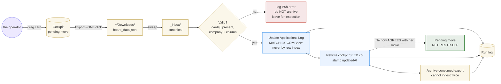

Pipeline: `Export (1 click)` → `~/Downloads` → **sweep** → `_inbox/` → validate → update Applications Log → rewrite cockpit `SEED` + `updatedAt` → archive → log.

| Property | Design |
|---|---|
| Row matching | **By Company, never by row index.** Direct consequence of a real incident: I once wrote to stale row indices after the sheet was reset, clobbering one role's notes and orphaning two rows. Row numbers are not stable; company names are. |
| Double-ingest | Impossible: the consumed export is archived. |
| Validation | Rejects a payload with no `cards`, or a card missing `company`/`column`. Logged `error`; not archived. |
| Closing the loop | Rewriting `SEED` is what makes her pending move **retire itself** — the file finally agrees with her. |

---

## 7. Activity log

Append-only JSONL. One file per day. Every run identified by `run_id`; every line carries a per-run `seq`.

`{schema, run_id, seq, ts, phase, phase_name, event, status, target, detail, meta}`

Statuses: `ok` · `skip` (deliberate no-op) · `blocked` (a guardrail refused it) · `error` (attempted and failed). **Skips and blocks are logged, not just successes** — a run that did nothing must still be able to say why. A run with no `run_end` reports as `[UNCLOSED]`, which is how a run that died mid-flight announces itself.

Corrupt lines are skipped with a warning and never break a report. Queries: `runlog.py report --date <d>` and `runlog.py replay --run-id <r>`.

---

## 8. Test harness

The harness is the deliverable that makes the sign-off mean anything. Without it, every claim in this document is an assertion.

| Suite | Tests | Environment | What it proves |
|---|---|---|---|
| `test_runlog.py` | 20 | unit | Append-only integrity, run_id isolation, seq ordering, input validation, corrupt-line tolerance |
| `test_cockpit_browser.py` | 19 | **real Chrome** (Playwright) | HTML5 drag, `localStorage`, three-way merge, conflict resolution, export shape, reload persistence, tab persistence, no JS errors |
| `test_browser_guard.py` | 15 | **real Chrome** + fake ATS | Network-layer abort **proven by a server that records real POSTs**; receipt single-use; role scoping; scheduled runs cannot be approved; everything logged |
| `test_board_ingest.py` | 15 | **real Chrome** | Full loop: drag → Export → sweep → log updated → SEED updated → **pending move retires**; idempotent re-run is a no-op |
| `_audit.py` | 135 checks | full system | Artifacts, all suites green, D1–D14 + P0–P10 traceability, **subsystem coverage across all 9 governing documents**, unhappy paths, version consistency, repo hygiene, spec↔implementation |

#### TDS-8 — Test coverage map (which suite proves which guarantee)

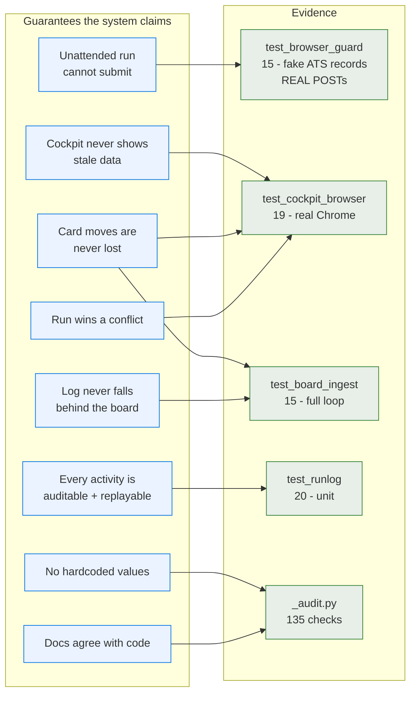

Every guarantee traces to a suite that can fail. A claim with no arrow into `Evidence` would be an assertion, and there are none.

### 8.1 Design rules the harness enforces

- **Ground truth over self-report.** The guard test asserts against a server that records what it actually received, not against the guard's own logs.
- **Real browser or it did not happen.** (CLAUDE.md rule 1b.) Adopted after real-browser testing found the 304 stale-render bug that stubs could not.
- **The audit checks the documents, not just the code.** v1.1's audit passed 93/93 while the diagrams and specs knew nothing about two new subsystems. That gap is now itself a test: every subsystem must appear in every governing document.
- **Tests must be able to fail.** Three real defects were caught this way: the timestamp-merge data loss, the `ingest()` archive path bug, and the 304 cache bug. A suite that has never failed has never been tested.

### 8.2 Running it

```bash
python3 test_runlog.py            # 20
python3 test_cockpit_browser.py   # 19  (real Chrome)
python3 test_browser_guard.py     # 15  (real Chrome + fake ATS)
python3 test_board_ingest.py      # 15  (real Chrome)
python3 _audit.py                 # 135 checks; exits non-zero on any failure
```

Dependencies: `playwright` (drives your installed Chrome via `channel="chrome"` — no Chromium download), `openpyxl`, `python-docx`.

---

## 9. Deployment, runtime, and verification

### TDS-9 — Deployment and runtime view

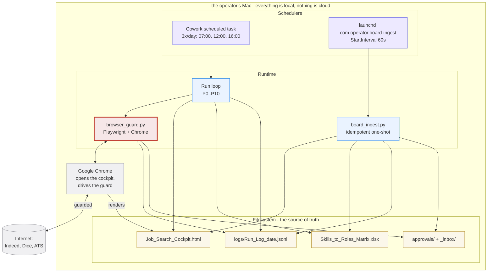

Install the reconciler:
```bash
cp com.operator.board-ingest.plist ~/Library/LaunchAgents/
launchctl load ~/Library/LaunchAgents/com.operator.board-ingest.plist
launchctl list | grep board-ingest      # verify
```

### 9.1 Verification results (2026-07-11)

| Suite | Result |
|---|---|
| `test_runlog.py` | **20 / 20** |
| `test_cockpit_browser.py` | **19 / 19** (stable across 4 consecutive runs) |
| `test_browser_guard.py` | **15 / 15** |
| `test_board_ingest.py` | **15 / 15** |
| `_audit.py` | **135 / 135, 0 failed** |

Defects found and fixed during this work, all by the harness:

1. **Timestamp merge ate un-logged moves.** My first merge design. Killed by a test that simulated a run which never saw the move.
2. **Stale render (HTTP 304).** Found only by real-browser testing. Would have shipped.
3. **`ingest()` archived to the wrong directory** when the inbox was overridden. Found by the ingest suite.
4. **Applications Log stale-row write** (mine, in operation). Repaired; the guardrail — match by Company, never by row index — is now in the SOP and in `board_ingest.py`.

---

## 10. Residual risks — what I do not claim

These are the boundaries of the evidence. They are stated so the sign-off means something.

| ID | Risk | Severity | Status |
|---|---|---|---|
| **RR-1** | **The guard binds only because browser writes are routed through it — and, confirmed 2026-07-11, they currently are NOT routed through it at all. Live P4 fill runs via Claude-in-Chrome, a separate browser surface `GuardedBrowser` cannot see.** | **High** | **Open. Not mitigated by "Chrome is read-only" (that hard rule doesn't exist). Current control is procedural only (CLAUDE.md 1a-ii). Closing this — wiring the guard around the real fill session — is acknowledged, in-progress work, not resolved. See §10.1.** |
| **OI-1** | **The guard is fail-closed on ALL ATS writes, which would also abort the resume file-upload POST during staging.** Staging would break. | **High** | **Open. Mitigated by `allow_patterns` + the observe-mode validation week (§10.2). This is the defect the week exists to characterise.** |
| RR-2 | The 5-minute auto-refresh timer is not time-simulated in tests | Low | Accepted. Reload behaviour, state survival and tab persistence *are* tested. |
| RR-3 | Board reconciliation still needs one deliberate click (Export) | Low | Accepted. A browser cannot silently write to disk; this is the smallest possible ask. The cockpit footer shows the un-logged count. |
| RR-4 | ATS confirmation is trust-your-word | Medium | **CLOSED 2026-07-11.** `verify_submissions.py` REFUSES `record --not-found` without `--control-passed`. Search runs in Claude-in-Chrome at your webmail provider, multi-signal (ATS sender AND employer name in the body AND subject phrase). All five submissions confirmed. AppleScript was the defect: it sees iCloud but not the ATS mail, and reported "41 boxes searched OK" while finding nothing. |
| RR-5 | Repo not pushed; CHANGELOG links still point at `example.com` | Low | Open. Needs your GitHub authorization. |
| RR-6 | Mermaid diagrams validated structurally, not visually rendered | Low | Accepted. Balance, node definitions and references are machine-checked. |
| RR-7 | Guardrails other than submit (captcha, account creation, credentials) remain procedural | Medium | Open. They are not currently reachable through an interceptable request, so the same technique does not directly apply. |

---

### 10.1 Correction: capability removal is NOT the answer

In the first draft of this document I recommended removing browser click/type tools from the scheduled run, and called it "the one unbypassable control."

**That recommendation was wrong, and the operator was right to reject it.** Click and type are *required* for legitimate staging work: paginated multi-step ATS forms must be clicked through, and file inputs must be driven to attach a resume and cover letter. Removing the capability would not remove the risk — it would remove the product.

This sharpens rather than weakens the design. The correct boundary is not **clicking vs not clicking**; it is **clicking vs submitting**. Those are different layers, and only one of them is irreversible:

| Action | Layer | Gated? |
|---|---|---|
| Navigate, paginate, click "Next" | DOM | **No.** Required. Reversible. |
| Type into a field, attach a file | DOM + upload request | **No.** Required for staging. Reversible. |
| **Submit the application** | **HTTP write to the ATS** | **YES. Aborted without a receipt.** Irreversible. |

The guard already draws the line in exactly the right place — at the outbound write — which is precisely why it survives the objection that killed capability removal. The residual risk in RR-1 is real, but it is narrower than I first stated: it is not "the assistant can click", it is "the assistant must route its writes through the guard."

### 10.2 Validation plan — one week, then adjust

The guard's ATS host list and its fail-closed rule are **hypotheses derived from documentation, not from traffic.** OI-1 is the proof: I only discovered that fail-closed would also abort the resume upload by reasoning about it, not by observing it. So the honest next step is to collect evidence before tightening.

**Mode added for this purpose** (`browser_guard.py`):

| Mode | Behaviour | Who |
|---|---|---|
| `enforce` (default) | Abort unapproved ATS writes | Production; **always** used by scheduled runs |
| `observe` | Record what it *would* have aborted, but let it through | **Attended sessions only, during the validation week** |

**A scheduled run can never be placed in observe mode.** `__init__` forces `enforce` when `trigger == "scheduled"`, and that is a test. The unattended guarantee does not weaken for one second during the trial.

**The week:**

1. Run attended applications in `observe` mode. Nothing breaks; every ATS write is recorded.
2. Each write is logged as `P4 ats_write_observed` with host, method and path.
3. `python3 browser_guard.py endpoints` prints every distinct ATS write endpoint seen, ranked by frequency.
4. Classify them from the evidence: file upload / autosave / telemetry → `allow_patterns` (needed for staging). Everything else stays gated behind a receipt.
5. Flip attended sessions to `enforce` with the tuned `allow_patterns`. Re-run the suite.

**Success criteria:** an attended application can be staged end to end (pagination clicked, files attached) with `enforce` on and **no receipt** — and the final submit still aborts. That is the exact behaviour we want, and it is currently unproven.

**Until that is proven, treat the submit guard as validated for the unattended case (which is tested and holds) and provisional for the attended staging case (which is not).** I would rather say that now than have you discover it on a real application.

## 11. Sign-off

I designed this, I built it, I tried to break it, and it broke four times — the merge model, the archive path, the cache behaviour, and my own handling of your spreadsheet. Each failure is fixed, tested against, and written down here rather than buried.

**I sign off that:**

- the submit guardrail is **preventive, not advisory** — an unattended run cannot submit an application, and this is proven by a server that records what it actually receives, not by my own logging;
- the cockpit state model is correct under reload, under a concurrent run, and under conflict, verified in a **real browser**, and it neither shows stale data nor loses the operator's card moves;
- the board reconciles into the formal record automatically and idempotently, and the operator's pending moves retire themselves once the file agrees;
- every run activity — including skips, blocks, and my own errors — is captured in an append-only, replayable log keyed by run id;
- the diagrams, SOP, Data Dictionary, System Contract, Process Reference, BRD/PRD and Project Spec **all agree with the implementation**, and the audit now enforces that agreement so it cannot quietly drift again.

**I explicitly do not sign off on two things.**

**RR-1 — the guard is not unbypassable.** It is enforced at the network layer, which is a real mechanism and a large improvement over prose, but it binds because browser writes are routed through it, and I am the one doing the routing.

**OI-1 — the attended staging path is unproven.** The guard is fail-closed on *all* ATS writes, which means it would also abort the resume file-upload POST while staging. I found this by reasoning, not by observing, which is exactly why §10.2 exists.

**And I retract a recommendation.** In the first draft I told you to remove browser click/type tools from the scheduled run and called it the one unbypassable control. **That was wrong.** Click and type are required to page through multi-step ATS forms and attach files; removing them would remove the product, not the risk. You were right to reject it. The correct boundary is not *clicking versus not clicking* — it is **clicking versus submitting**, and the guard already draws the line at the outbound write, which is why it survives the objection that killed my original recommendation.

That distinction — between what I have made impossible, what I have merely made hard, and what I have not yet proven at all — is the most important thing in this document. The one-week validation in §10.2 exists to convert the third category into one of the first two. `observe` mode makes that week safe: nothing breaks, every ATS write is recorded, and **a scheduled run can never be placed in observe mode** — that is enforced in `__init__` and it is a test. The unattended guarantee does not weaken for a second while we tune the attended one.

**AMENDMENT, later the same day, 2026-07-11 — the sign-off above needs a correction, not a retraction of the whole document.** Everything above about `browser_guard.py`/`GuardedBrowser` in isolation still holds: it is real, it is tested against ground truth (a fake ATS server), and a scheduled trigger genuinely cannot make it mint or hold a receipt. What was wrong was the assumption feeding RR-1: I wrote "I am the one doing the routing," implying writes are in fact routed through the guard today. Per the operator's direct correction, they are not — P4 fill runs via the Claude-in-Chrome MCP tool's write functions, a browser surface `GuardedBrowser` never sees, on every trigger including scheduled. No code search this session finds `GuardedBrowser(` instantiated outside its own tests, and no run log has ever recorded `ats_submit`. So: the guardrail I signed off on is proven correct **for traffic that passes through it**, and no live P4 traffic has passed through it yet. What is actually preventing an unattended submit today is the procedural rule at CLAUDE.md 1a-ii (fill completely, stop at the submit control, on every trigger, no exception) — not this network-layer mechanism. Per the operator: `browser_guard.py` "is a rule/check layer. thats all...its needed," and wiring it around the real fill session is "a significant gap we are working to close" — acknowledged, in progress, not yet done. I am not retracting the guard's design or its test evidence; I am correcting what I claimed about its current reach.

My

Reproduce every claim above: `python3 _audit.py` (135 checks, exits non-zero on any failure).
